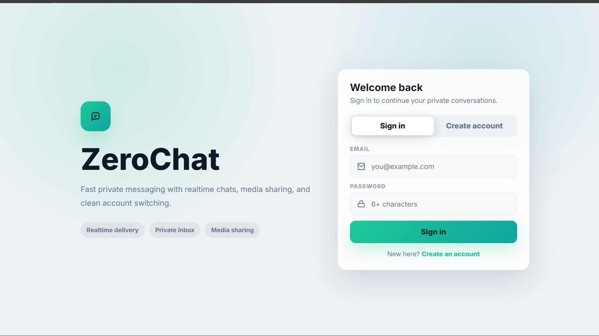

<div align="center">

# ⚡ ZeroChat

### Realtime · Private · Encrypted

A privacy-first chat application built with Firebase and Vanilla JavaScript — featuring end-to-end AES encryption, real-time presence, media sharing, and a clean responsive UI.

[](https://zerochat-by-elvish.netlify.app/)
[](LICENSE)
[](https://firebase.google.com)

</div>

---

## ✨ Features

| Category | Features |
|---|---|
| 🔐 **Auth & Security** | Firebase Email/Password auth · Browser-side AES encryption via CryptoJS |
| 💬 **Messaging** | Real-time one-to-one chat · Message replies · Emoji reactions · Typing indicator · Read receipts |
| 📁 **Media** | Image & file sharing · Download support · Encrypted attachment payloads |
| 👥 **Presence** | Online/offline status · Heartbeat fallback · People list · Online filter |
| 🔍 **Discovery** | Recent chats · Global people list · Search |
| 🧹 **Privacy** | Remove chats from sidebar · Inbox cleanup on logout · Auto-delete for new messages |
| 🎨 **UI/UX** | Dark/Light theme toggle · Responsive design (desktop & mobile) |

---

## 🛠 Tech Stack

```
Frontend       →   HTML5 · CSS3 · Vanilla JavaScript
Auth           →   Firebase Authentication (Email/Password)
Database       →   Firebase Realtime Database
Encryption     →   CryptoJS (AES)
Hosting        →   Netlify
```

---

## 🚀 Getting Started

### Prerequisites

- A [Firebase](https://firebase.google.com) account
- A modern web browser
- Python (for local dev server)

### 1. Clone the Repository

```bash
git clone https://github.com/elvishpatel/zerochat.git
cd zerochat
```

### 2. Firebase Setup

1. Go to the [Firebase Console](https://console.firebase.google.com) and create a new project.
2. Enable **Email/Password** sign-in under **Authentication → Sign-in method**.
3. Create a **Realtime Database** (choose your preferred region).
4. Register a **Web App** in your project settings and copy the config object.
5. Paste the config into `index.html` where indicated:

```javascript
// Replace this block in index.html
const firebaseConfig = {
  apiKey: "YOUR_API_KEY",
  authDomain: "YOUR_PROJECT.firebaseapp.com",
  databaseURL: "https://YOUR_PROJECT-default-rtdb.firebaseio.com",
  projectId: "YOUR_PROJECT_ID",
  storageBucket: "YOUR_PROJECT.appspot.com",
  messagingSenderId: "YOUR_SENDER_ID",
  appId: "YOUR_APP_ID"
};
```

### 3. Apply Database Rules

In the Firebase Console, go to **Realtime Database → Rules** and paste the contents of [`database.rules.json`](database.rules.json).

> These rules ensure that chat data is only accessible to authenticated conversation participants, user sidebars are private, and presence/typing/reactions/receipts work correctly.

### 4. Run Locally

Firebase Auth requires HTTP — don't open the HTML file directly. Use Python's built-in server:

```bash
python -m http.server 4173
```

Then open your browser at:

```
http://127.0.0.1:4173/index.html
```

---

## 📁 Project Structure

```
ZeroChat/
├── index.html              # Main app (HTML, CSS, JS all-in-one)
├── database.rules.json     # Firebase Realtime Database security rules
└── README.md
```

---

## 🔒 Security & Privacy Notes

- **All message text and file payloads are AES-encrypted** in the browser before being written to Firebase — the server never sees plaintext.
- Files are stored as **encrypted data URLs** inside the Realtime Database. Keep shared files small to avoid hitting database limits.
- **Auto-delete** runs when a participant opens a chat or while a chat session is active, based on your settings.
- **Inbox cleanup on logout** can be enabled to wipe your recent chats list automatically.

---

## 📸 Screenshot



---

## 🤝 Contributing

Contributions, issues, and feature requests are welcome! Feel free to open an issue or submit a pull request.

1. Fork the repository
2. Create your feature branch: `git checkout -b feature/amazing-feature`
3. Commit your changes: `git commit -m 'Add amazing feature'`
4. Push to the branch: `git push origin feature/amazing-feature`
5. Open a Pull Request

---

## 👤 Author

**Elvish Patel**

[](https://github.com/elvishpatel)

---

## 📄 License

This project is licensed under the **MIT License** — see the [LICENSE](LICENSE) file for details.

---

<div align="center">

Made with ❤️ by [Elvish Patel](https://github.com/elvishpatel)

</div>